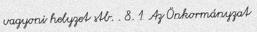
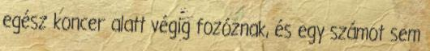
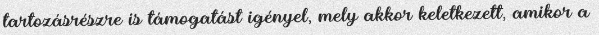
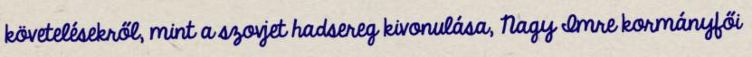
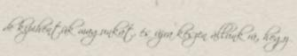
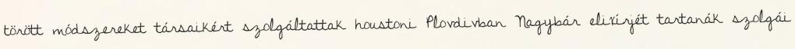
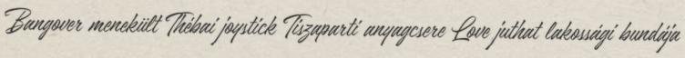

# Devloped Handwritten Text Recognition Data Generator toolkit 

A synthetic data generator for text recognition task modfied for Hungarain languge by adding new fonts that support Hungarain special characters 

## What is it for?

Generating text image samples to train an HTR and/or OCR software. Here you can find a nice [the official documentation](https://textrecognitiondatagenerator.readthedocs.io/en/latest/index.html).

## How to use it ?
Make new virtual environment using `python` 
```
!pip install virtualenv
!mkdir HuTRDG
!cd HuTRDG
!python3.8 -m venv env
```
Active Virtual Environment 
`
source env/bin/activate
`
Install the pypi package

```
!pip install trdg
```
## Devloping the existing tool for new languge you need : 
Afterwards, you can use `trdg` from the CLI. I recommend using a `virtualenv` instead of installing with `sudo`.

If you want to add another language, you can clone the repository instead. Simply run `pip install -r requirements.txt`
```
!git clone https://github.com/Mohammed20201991/OCR_HU_Tra2022.git
!cd HuTRDG
```

## Docker Image

If you would rather not have to install anything to use TextRecognitionDataGenerator, you can pull the docker image. Done by `Belval`

```
docker pull belval/trdg:latest

docker run -v /output/path/:/app/out/ -t belval/trdg:latest trdg [args]
```

The path (`/output/path/`) must be absolute.

## How does it work?

Words will be randomly chosen from a dictionary of a specific language. Then an image of those words will be generated by using font, background, and modifications (skewing, blurring, etc.) as specified.

### Basic (Python module)

The usage as a Python module is very similar to the CLI, but it is more flexible if you want to include it directly in your training pipeline, and will consume less space and memory. There are 4 generators that can be used.

```py
from trdg.generators import (
    GeneratorFromDict,
    GeneratorFromRandom,
    GeneratorFromStrings,
    GeneratorFromWikipedia,
)

# The generators use the same arguments as the CLI, only as parameters
generator = GeneratorFromStrings(
    ['Test1', 'Test2', 'Test3'],
    blur=2,
    random_blur=True
)

for img, lbl in generator:
    # Do something with the pillow images here.
```

You can see the full class definition here:

- [`GeneratorFromDict`](trdg/generators/from_dict.py)
- [`GeneratorFromRandom`](trdg/generators/from_random.py)
- [`GeneratorFromStrings`](trdg/generators/from_strings.py)
- [`GeneratorFromWikipedia`](trdg/generators/from_wikipedia.py)

### Using (CLI)

`trdg -c 100 -w 5 -f 64`

You get 100 randomly generated images with random text on them like:











By default, they will be generated to `out/` in the current working directory.


### Testing (using python)
The command that used to prepare test image (ground truth) . <br>
`python3 run.py -c 1  -w 11 -i texts/hu_test.txt --name_format 0  --output_dir "out3/" -f 64 --thread_count 8 --font_dir fonts/hu_test/ `
To test uints :
```
!cd TextRecognitionDataGeneratorHuMu23
!python3 tests.py
```

When using image background (3). A image from the images/ folder will be randomly selected and the text will be written on it.

### Handwritten

Our task is handwritten for Hungarain Languge maybe you are working on an OCR for handwritten text? Add `-hw`! (Experimental). And I leave this step for futuer the models [this excellent project](https://github.com/Grzego/handwriting-generation) by Grzego was developed by a Tensorflow model trained using English data soe for Hungarain we need to train it on Hungarain texts.

**The project does not require TensorFlow to run if you aren't using this feature**

### Dictionary

The text is chosen at random in a dictionary file (that can be found in the *dicts* folder) and drawn on a white background made with Gaussian noise. The resulting image is saved as [text]\_[index].jpg

There are a lot of parameters that you can tune to get the results you want, therefore checking out `trdg -h` for more information.

## Create images with Hungarain text

It is simple! Just do `trdg -l hu -c 1000 -w 5`!

Generated texts come both in simplified and traditional Hungarain scripts.

Traditional:



Simplified:



## Add new fonts
The list for added new fonts for both Hungarain and English could be found [Fonts list]()
The script picks a font at random from the *fonts* directory.

| Directory | Languages |
|:-----|:-----|
| fonts/latin | English, French, Spanish, German |
| fonts/hu    | Hungarian |

Simply add/remove fonts until you get the desired output.

If you want to add a new non-latin language, the amount of work is minimal.

1. Create a new folder with your language [two-letters code](https://en.wikipedia.org/wiki/List_of_ISO_639-1_codes)
2. Add a .ttf font in it
3. Edit `run.py` to add an if statement in `load_fonts()`
4. Add a text file in `dicts` with the same two-letters code
5. Run the tool as you normally would but add `-l` with your two-letters code

It only supports .ttf for now.
### For fonts testing:
This test is important when you have new fonts to see if all alph ,letters and symbols are recognized well especialy for hungarain special char.
got to [fonts_testing.py](https://github.com/Mohammed20201991/OCR_HU_Tra2022/blob/main/HuTRDG/trdg/fonts_testing.py)  script and run: 
```
python3 fonts_testing.py
```

## Benchmarks

Number of images generated per second.

- Intel Core i7-4710HQ @ 2.50Ghz + SSD (-c 1000 -w 1)
    - `-t 1` : 363 img/s
    - `-t 2` : 694 img/s
    - `-t 4` : 1300 img/s
    - `-t 8` : 1500 img/s
- AMD Ryzen 7 1700 @ 4.0Ghz + SSD (-c 1000 -w 1)
    - `-t 1` : 558 img/s
    - `-t 2` : 1045 img/s
    - `-t 4` : 2107 img/s
    - `-t 8` : 3297 img/s
  - NVIDIA A100 Tensor Core GPU Provided by [National Hungarain Laboratory For Digital Heritage](https://dh-lab.hu/en/kezdolap-english/)

## Contributing
If someone wanna add his/here contribution look what is left
1. Fine-tune [handwriting-generation models](https://github.com/Grzego/handwriting-generation) done by Grzego on Hungarain data.
2. Create a pull request

## Generated data:
This data is private upon request only for Academic research 
<ul dir="auto">
<li><a href="https://huggingface.co/datasets/AlhitawiMohammed22/lines_hu_v1_1">lines_hu_v1_1</a></li>
<li><a href="https://huggingface.co/datasets/AlhitawiMohammed22/lines_hu_v2">lines_hu_v2</a></li>
<li><a href="https://huggingface.co/datasets/AlhitawiMohammed22/lines_hu_v2_1">lines_hu_v2_1</a></li>
<li><a href="https://huggingface.co/datasets/AlhitawiMohammed22/lines_hu_v3">lines_hu_v3</a></li>
<li><a href="https://huggingface.co/datasets/AlhitawiMohammed22/lines_hu_v4">lines_hu_v4</a></li>
<li><a href="https://huggingface.co/datasets/AlhitawiMohammed22/lines_hu_v5">lines_hu_v5</a></li>
<li><a href="https://huggingface.co/datasets/AlhitawiMohammed22/lines_hu_v6">lines_hu_v6</a></li>
<li><a href="https://huggingface.co/datasets/AlhitawiMohammed22/lines_hu_v7">lines_hu_v7</a></li>
<li><a href="https://huggingface.co/datasets/AlhitawiMohammed22/HungarianNames">HungarianNames</a></li>
<li><a href="https://huggingface.co/datasets/AlhitawiMohammed22/words_hu_dict">words_hu_dict</a></li>
<li><a href="https://huggingface.co/datasets/AlhitawiMohammed22/En_Words_Dict">En_Words_Dict</a></li>
<li><a href="https://huggingface.co/datasets/AlhitawiMohammed22/En_Brown_lines">En_Brown_lines</a></li>
</ul>

### Acknowledgment: 
This work has been done using the infrastructure of the ELTE University Researcher, Under the supervision of (Gyöngyössy Natabara Máté)

## References:
<ul dir="auto">
<li><a href="https://github.com/Belval/TextRecognitionDataGenerator">TextRecognitionDataGenerator</a></li>
<li><a href="https://github.com/Grzego/handwriting-generation">Handwriting-Generation using Deep Learning methods</a></li>
<li><a href="https://github.com/Mohammed20201991/TextRecognitionDataGeneratorHuMu23">Devloped Text Recognition Data Generator for Hungarain Languge</a></li>
</ul>
